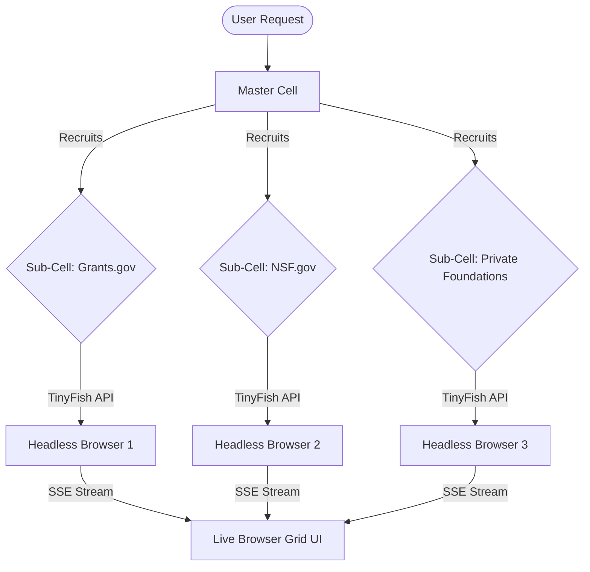
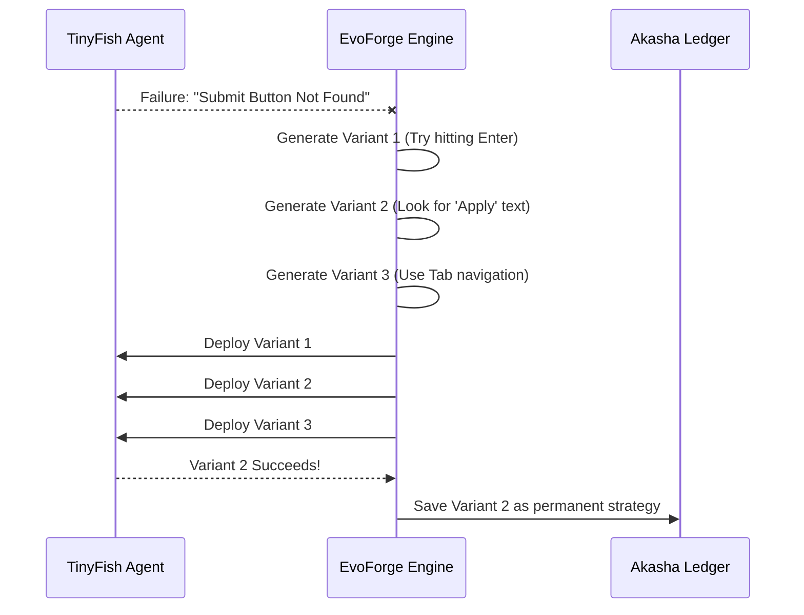

# GrantWeave

<div align="center">
  
  <h1>GrantWeave</h1>
  <h3>Autonomous, Self-Healing Grant Hunting Platform</h3>
  <p>Powered by the <strong>AetherForge Kernel</strong> and the <strong>TinyFish Web Agent API</strong></p>
  
  <p>
    <a href="#overview">Overview</a> •
    <a href="#core-architecture-aetherforge">Architecture</a> •
    <a href="#features">Features</a> •
    <a href="#tech-stack">Tech Stack</a> •
    <a href="#getting-started">Getting Started</a>
  </p>
</div>

---

## 🚀 Overview

The world of grant applications is notoriously fragmented, outdated, and labor-intensive. Startups and nonprofits waste hundreds of hours manually navigating clunky government portals (like Grants.gov) and obscure foundation websites just to find opportunities they qualify for.

**GrantWeave automates this entirely.** 

GrantWeave is a real-world SaaS that deploys parallel, autonomous web agents to hunt for grants, match them against your organization's profile, and prepare the initial application package. Instead of scraping APIs (which most grant portals lack), GrantWeave uses the [TinyFish Web Agent API](https://agent.tinyfish.ai) to literally drive headless browsers in the cloud, navigating portals exactly like a human would.

---

## 🧠 Core Architecture: AetherForge

At the heart of GrantWeave is the **AetherForge Kernel**, a proprietary orchestration layer designed specifically to manage, coordinate, and heal autonomous web agents. The kernel is composed of four primary subsystems:

### 1. The Weave Mesh (Task Orchestration)
The **Weave Mesh** is responsible for dynamic agent coordination. When a user requests a "Hunt", the orchestrator spawns a Master Cell. This Master Cell analyzes the target portals and recursively recruits Sub-Cells to execute searches concurrently. It utilizes asynchronous semaphore limits to prevent overwhelming the backend or the TinyFish API.



### 2. EvoForge (Self-Healing Mutations)
Websites change constantly. Traditional scrapers break when a button is moved. **EvoForge** solves this. If a TinyFish agent reports a failure (e.g., "Could not find Next button"), EvoForge intercepts the failure, analyzes the DOM context, and automatically mutates the original goal into 3-5 variant strategies. These variants race each other; the first to succeed dictates the new path forward.



### 3. The Akasha Ledger (Permanent Memory)
When EvoForge discovers a successful mutation, that knowledge shouldn't be lost. The **Akasha Ledger** is a local SQLite-based vector-like memory bank. Before any agent starts a task, it checks the Ledger. If a known-working template exists for a specific portal, the agent bypasses standard discovery and uses the optimized, proven strategy, drastically reducing execution time and API costs.

### 4. Temporal Fabric (Resilient State)
Hunts can take minutes. If a server restarts or a connection drops, progress is preserved. The **Temporal Fabric** continuously checkpoints the `Cell` states into the database as compressed JSON blobs. When the system re-initializes, it re-inflates the Weave Mesh exactly where it left off.

---

## ✨ Features

*   **Live Multi-Browser Extraction:** A dashboard grid displaying up to 6 real-time `iframe` feeds of TinyFish agents driving headless browsers.
*   **Dynamic Mind Maps:** A live `@tldraw` canvas that organically grows, connecting your organization's focus areas to newly discovered grants as they are found via SSE.
*   **Real-time EvoLog:** Watch the EvoForge mutation engine visually intercept errors and deploy variant strategies in real time.
*   **Team Handoff (WebSockets):** Generate a QR code or share link. Teammates can instantly join the live session, synchronized via WebSockets.
*   **Export Pipeline:** One-click PDF generation utilizing `fpdf2` to seamlessly pre-fill grant application forms with your organization's exact payload.
*   **GrantWeave Wrapped:** A Spotify-style weekly visualization of your agent performance, portals scanned, and top matches.

---

## 🛠 Tech Stack

Designed to be robust, asynchronous, and entirely local-first (no cloud DBs required).

| Category | Technology | Purpose |
| :--- | :--- | :--- |
| **Backend** | Python, FastAPI, asyncio | Core high-performance API and async orchestration |
| **Database** | SQLite, `aiosqlite` | Local, file-based relational storage (No Redis/Postgres needed) |
| **Streaming** | SSE (Server-Sent Events) | Real-time push of agent tracking and log data directly to UI |
| **Agent API** | TinyFish API | The engine executing natural language as browser actions |
| **Frontend** | React 18, Vite, TypeScript | Fast, strictly typed component architecture |
| **State** | Zustand | Lightweight frontend state management |
| **Styling** | Tailwind CSS | Custom dark-mode glassmorphism design system |
| **Canvas** | `@tldraw/tldraw` | Infinite canvas for the grant discovery Mind Map |

---

## ⚙️ Getting Started

### 1. Prerequisites
*   Python 3.9+
*   Node.js 18+
*   A TinyFish API Key ([Get one here](https://agent.tinyfish.ai))

### 2. Backend Setup
The backend handles the AetherForge kernel and database generation.

```bash
cd backend

# Create and activate a virtual environment
python -m venv venv
source venv/bin/activate  # On Windows: venv\Scripts\activate

# Install the Python dependencies
pip install -r requirements.txt

# Run the database seeder (Crucial: This generates demo orgs and past sessions)
python seed_db.py
```

### 3. Environment Configuration
From the project root:
```bash
cp .env.example .env
```
Open `.env` and paste your `TINYFISH_API_KEY`.

### 4. Frontend Setup
```bash
cd frontend
npm install
```

### 5. Running the Application
You will need two terminal windows running concurrently.

**Terminal 1 (FastAPI Backend):**
```bash
cd backend
# Ensure venv is active
uvicorn main:app --reload --port 8000
```

**Terminal 2 (React Frontend):**
```bash
cd frontend
npm run dev
```

Open your browser to: **http://localhost:5173**

---


